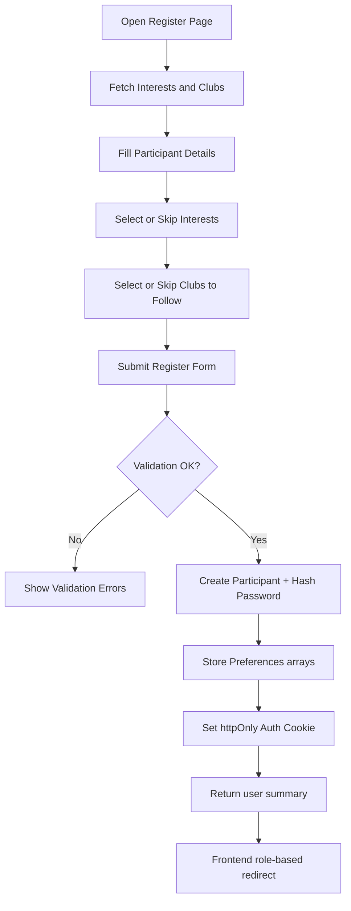
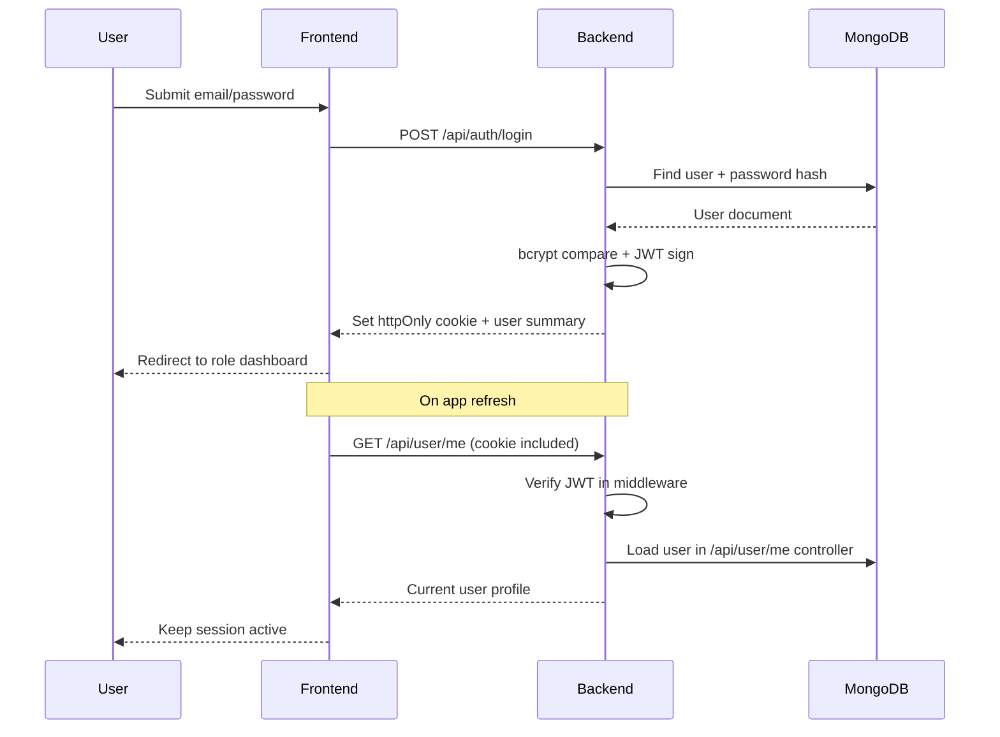
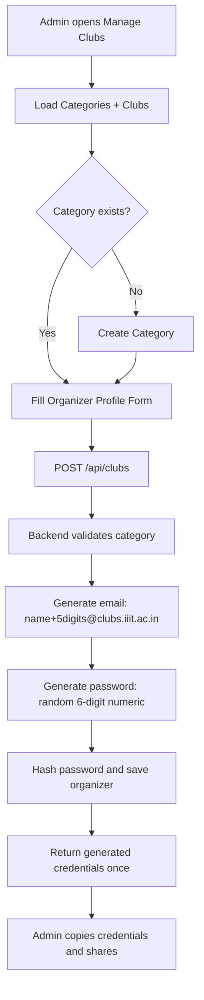
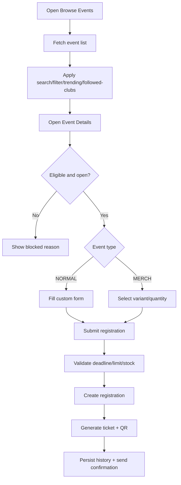
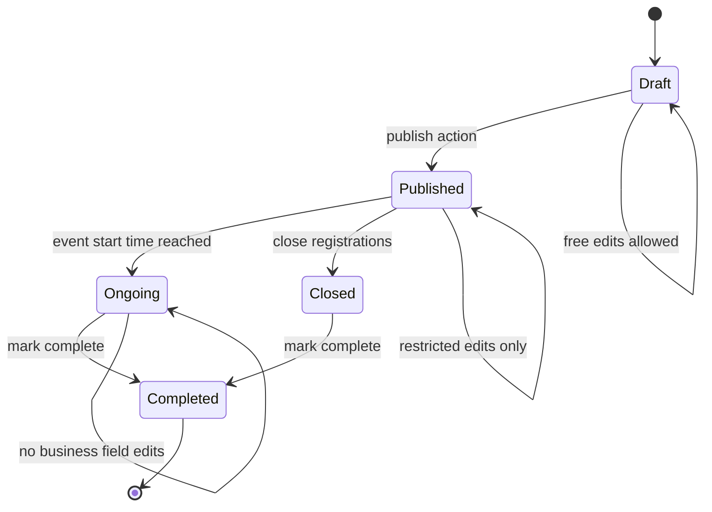
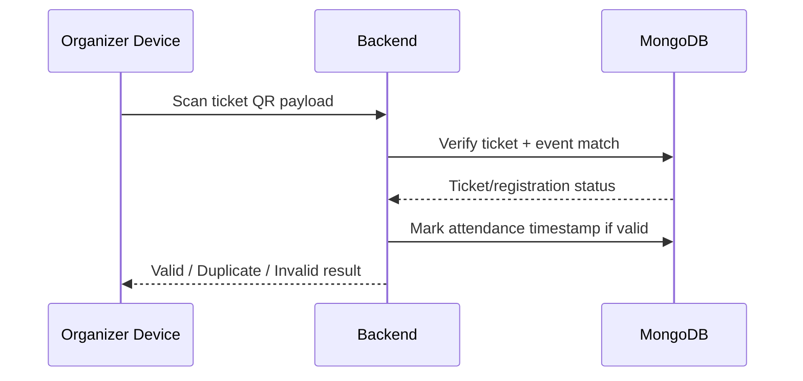

# Felicity Event Management System - Detailed End-to-End Design Document

## 1. Purpose
This document is the technical source of truth for building the Felicity Event Management System as defined in Assignment 1. It is written to support implementation, review, debugging, and final evaluation.

It covers:
- Current implemented architecture and flows
- Target architecture for remaining Part-1 sections
- Detailed API and data contracts
- Business rules and validation constraints
- Role-based UX and backend authorization logic
- Testing and rollout guidance

Practicality-first rules used in this document:
- Prefer one clear API per page over multiple fragmented calls for MVP flows.
- Prefer explicit validation and deterministic errors over implicit behavior.
- Prefer simple, role-guarded pages that work end-to-end before UI polish.
- Keep assignment-compliance requirements explicit, then map them to a minimal implementation profile.

---

## 2. Product Context and Problem Statement
Felicity operations currently rely on manual/fragmented tools (forms, sheets, chats), causing:
- Registration uncertainty for participants
- Poor participant visibility for organizers
- Operational inconsistency and delayed decisions
- Weak traceability for payments/tickets

System goals:
1. Centralize all participant-organizer-admin interactions.
2. Enforce strict role ownership and permissions.
3. Provide secure authentication and persistent sessions.
4. Support event lifecycle creation, discovery, registration, and tracking.
5. Keep architecture extensible for advanced features (Part-2).

---

## 3. System Boundaries
### 3.1 In-Scope (Part-1)
- Auth and role management
- User onboarding and preferences
- Organizer provisioning by admin
- Event management workflows
- Participant event discovery and registration
- Ticket generation and participation history
- Organizer analytics and participant management
- Deployment links and production readiness basics

### 3.2 Out-of-Scope (for now)
- Real-time sockets/chat infra unless selected in advanced features
- Large-scale distributed services
- Multi-tenant deployment or federated identity

---

## 4. Technology and Runtime
### 4.1 Backend
- Node.js
- Express
- Mongoose
- JWT
- bcrypt
- Zod

### 4.2 Frontend
- React + Vite
- React Router
- Axios (shared API client)

### 4.3 Database
- MongoDB (Atlas in deployment phase)

### 4.4 Config model
- Environment-driven configuration (`.env`) for DB URI, JWT secret, frontend origin, admin bootstrap credentials.

---

## 5. Architecture Overview
## 5.1 Backend Layering
1. **Routes**: endpoint declaration + middleware chain
2. **Controllers**: business orchestration and response shaping
3. **Models**: schema definitions and persistence
4. **Middleware**: authentication + role authorization + centralized error behavior
5. **Utils**: reusable logic (errors, credential generation, future ticket/email services)

## 5.2 Frontend Layering
1. **Page components**: route-level features
2. **Guard components**: `ProtectedRoute`, `PublicOnlyRoute`
3. **Context**: `AuthContext` for session/user state
4. **API client**: centralized axios instance (`src/lib/api.js`)

## 5.3 Request Lifecycle (Typical)
1. Page triggers API call via `api` client.
2. Browser sends httpOnly cookie automatically (`withCredentials`).
3. Backend `protect` verifies JWT and attaches decoded identity (`_id`, `role`, `email`) to `req.user` (no DB fetch inside middleware).
4. `restrictTo` enforces role where needed.
5. Controller validates body and executes model ops.
6. Response returns JSON DTO.
7. Frontend updates page state and rerenders.

---

## 6. Role Model and Access Matrix
## 6.1 Roles
- `IIIT_PARTICIPANT`
- `NON_IIIT_PARTICIPANT`
- `organizer`
- `admin`

## 6.2 High-level Access Matrix
| Capability | Participant | Organizer | Admin |
|---|---:|---:|---:|
| Register self | Yes | No | No |
| Login | Yes | Yes | Yes |
| Edit own profile | Yes | Yes | Yes |
| Set interests/followed clubs | Yes | No | No |
| Create event | No | Yes | No |
| Manage organizer accounts | No | No | Yes |
| Manage interest master data | No | No | Yes |

## 6.3 Ownership Clarification
Organizer account is also the club entity in this design:
- Public club identity fields: `organizerName`, category, description, `contactNumber`.
- Single email field policy: organizer `email` is the only email (used for both login and contact identity).

---

## 7. Data Model Design (Detailed)
## 7.1 Current Implemented Core Models
### 7.1.1 User (base)
Fields:
- `email: string` (unique, lowercase, trimmed)
- `password: string` (hashed, not selected by default)
- `role: enum`

Indexes:
- unique index on `email`

### 7.1.2 Participant discriminators
Shared participant fields:
- `firstName`, `lastName`
- `contactNumber`
- `collegeOrgName`
- `interests: ObjectId[] -> Interest`
- `followedClubs: ObjectId[] -> Organizer`

IIIT participant:
- `batch`
- email domain rule `@iiit.ac.in` (validated by Zod registration schema)

Non-IIIT participant:
- requires `collegeOrgName`

### 7.1.3 Organizer discriminator
- `organizerName` (public club name)
- `category: ObjectId -> OrganizationCategory`
- `description`
- `contactNumber`

### 7.1.4 Admin discriminator
- no extra fields currently

### 7.1.5 Interest
- `name` unique
- `description`
- `isActive` soft-delete flag

### 7.1.6 OrganizationCategory
- `name` unique
- `description`

## 7.2 Planned Event Domain Models (Part-1 Sections 7-10)
### 7.2.1 Event
Required fields:
- `name`
- `description`
- `type` (`NORMAL`, `MERCHANDISE`)
- `eligibility` (`ALL`, `IIIT_ONLY`, `NON_IIIT_ONLY`, optional custom in future)
- `registrationDeadline`
- `startDate`
- `endDate`
- `registrationLimit`
- `registrationFee`
- `organizerId`
- `tags`
- `status` (`DRAFT`, `PUBLISHED`, `ONGOING`, `CLOSED`, `COMPLETED`)

Type-specific shape:
- NORMAL:
  - `customFormSchema` (ordered list of fields: id, type, label, required, options, order)
- MERCHANDISE:
  - `items[]` with variant options, per-variant stock, purchase limits

### 7.2.2 Registration
- `participantId`
- `eventId`
- `status` (`REGISTERED`, `CANCELLED`, `REJECTED`, `COMPLETED`)
- `payload` (form data / merch selection)
- `createdAt`

### 7.2.3 Ticket
- `ticketId` (human-friendly unique)
- `participantId`
- `eventId`
- `registrationId`
- `qrData`
- `issuedAt`

### 7.2.4 Attendance (future-ready for advanced QR feature)
- `ticketId`
- `eventId`
- `participantId`
- `markedByOrganizerId`
- `timestamp`

---

## 8. API Contract Design (Detailed)
## 8.1 Implemented APIs
### 8.1.1 Auth
#### POST `/api/auth/register`
Input (participant only):
- base participant fields + participantType
- optional onboarding preferences: `interests[]`, `followedClubs[]`

Output:
- `message`
- `user` summary
- auth cookie set

Validation:
- IIIT email domain for IIIT participant
- Non-IIIT must include college/org name

#### POST `/api/auth/login`
Input:
- `email`, `password`

Output:
- `message`
- `user` summary
- auth cookie set

#### POST `/api/auth/logout`
Output:
- clears auth cookie

### 8.1.2 User
#### GET `/api/user/me`
- returns current user profile (non-populated base fields currently)

#### PUT `/api/user/profile`
- updates role-relevant mutable fields only

#### PUT `/api/user/interests`
- participant only
- validates all IDs are active interests

#### PUT `/api/user/followed-clubs`
- participant only
- validates all IDs map to existing organizers

#### PUT `/api/user/password`
- all roles
- requires currentPassword + newPassword

### 8.1.3 Interests
#### GET `/api/interests`
- returns active interests

#### POST/PUT/DELETE `/api/interests*`
- admin-only mutation

### 8.1.4 Clubs
#### GET `/api/clubs`
- public list of organizers with category populate

#### GET `/api/clubs/:id`
- public organizer detail

#### GET `/api/clubs/categories/all`
- public category list

#### POST `/api/clubs/categories`
- admin-only category creation

#### POST `/api/clubs`
- admin-only organizer provisioning
- input: organizer profile fields (no password/email from admin)
- output: created organizer + generated credentials once

#### PUT/DELETE `/api/clubs/:id`
- admin-only

## 8.2 Planned APIs for Remaining Part-1
### Events
- POST `/api/events`
- PUT `/api/events/:id`
- POST `/api/events/:id/publish`
- POST `/api/events/:id/close`
- GET `/api/events`
- GET `/api/events/:id`

### Participant actions
- POST `/api/events/:id/register`
- POST `/api/events/:id/purchase` (merch)
- GET `/api/user/events/upcoming`
- GET `/api/user/events/history`

### Organizer analytics
- GET `/api/organizer/events`
- GET `/api/organizer/events/:id/analytics`
- GET `/api/organizer/events/:id/participants`
- GET `/api/organizer/events/:id/participants/export`

---

## 9. Authentication, Session, and Security Design
## 9.1 Session Strategy
- JWT is signed backend-side and stored in `httpOnly` cookie.
- Frontend does not own token persistence in localStorage.
- Session restore happens via backend truth endpoint (`/api/user/me`).

## 9.2 CORS and Cookie Constraints
- `origin` must be explicit frontend URL when `credentials: true`.
- wildcard `*` with credentials is invalid in browsers.

## 9.3 Authorization Strategy
- Backend: source of truth (`protect` + `restrictTo`).
- Frontend: UX guardrails (`ProtectedRoute`, `PublicOnlyRoute`).

## 9.4 Password Security
- bcrypt hashing at rest
- no plaintext persistence
- generated organizer credentials returned once after provisioning
- current generated organizer credential format:
  - email: `<normalizedOrganizerName><random5digits>@clubs.iiit.ac.in`
  - password: random 6-digit numeric string

## 9.5 Current Security Gaps (to close)
- Add rate limiting for auth endpoints
- Add stricter payload validation on admin mutation endpoints
- Add audit logging for admin actions

---

## 10. Frontend UX Design by Role
## 10.1 Participant
Current:
- Register/Login
- Profile (edit + password + preferences)
- Basic dashboard placeholder

Target:
- Dashboard with upcoming + history tabs
- Browse events with search/filter/trending
- Event detail and registration flow
- Clubs listing and organizer detail views

## 10.2 Organizer
Current:
- Login
- placeholder dashboard

Target:
- Dashboard with event cards + analytics
- Create/edit/publish events
- Event participant list and exports
- Organizer profile settings

## 10.3 Admin
Current:
- Dashboard entry
- Manage clubs page (category + organizer provisioning)

Target:
- disable/archive/delete organizers
- manage password reset requests (if selected under advanced scope)

---

## 11. Implemented Flow Narratives
## 11.1 Participant registration with onboarding
1. User opens register page.
2. Page fetches interest and club options.
3. User enters account fields and optional preferences.
4. Submit triggers `/api/auth/register`.
5. Backend validates, hashes password, creates participant, sets cookie.
6. Frontend redirects by role to participant dashboard.

## 11.2 Session restore
1. App mounts.
2. Auth context calls `/api/user/me`.
3. If cookie valid, user state is set; else null.
4. Guards route user accordingly.

## 11.3 Admin organizer provisioning
1. Admin opens `/admin/clubs`.
2. Creates category (if needed).
3. Creates organizer with profile info.
4. Backend auto-generates login email/password, hashes password, persists organizer.
5. UI shows generated credentials once.

---

## 12. Remaining Functional Work (Part-1)
## 12.1 Sections 7-8
- Event schema and lifecycle
- Event type-specific validation and business rules

## 12.2 Section 9 participant features
- Full dashboard and history
- Browse/filter/search/trending
- Event detail with eligibility/deadline/limit checks
- Registration/purchase workflows
- Ticket + QR + email confirmation

## 12.3 Section 10 organizer features
- Event creation + edit constraints by status
- organizer event detail and analytics
- participant table with export

## 12.4 Section 11 admin management depth
- remove/disable/archive organizer actions

## 12.5 Section 12 deployment
- production URLs in `deployment.txt`

---

## 13. Error Handling Strategy
- Controllers pass explicit domain errors via central error utility.
- Validation errors return 400-level with readable message.
- Not-found and forbidden paths use semantic status codes.
- Frontend shows concise inline error status per form/action.

---

## 14. Testing Strategy
## 14.1 Backend tests
- Auth success/failure
- role-based access checks
- organizer provisioning contract
- profile and preference update validation

## 14.2 Frontend tests
- route guard behavior by role/auth state
- register onboarding data submission
- admin manage clubs flow and credentials visibility

## 14.3 End-to-end smoke flows
1. participant register -> login -> profile update
2. admin create category -> create organizer -> organizer login
3. participant follow club -> reflected in `/user/me`

---

## 15. Deployment and Runtime Ops
- Frontend hosted on static provider
- Backend hosted on managed Node provider
- MongoDB Atlas via env config
- `deployment.txt` stores public frontend URL + backend API base URL

Operational checklist:
- envs set (`MONGO_URI`, `JWT_SECRET`, `FRONTEND_URL`, admin seed creds)
- CORS origin matches deployed frontend
- cookies configured correctly for HTTPS

---

## 16. Design Decisions and Rationale
1. **User discriminators over separate auth tables**
   - simplifies unified auth and role checks.
2. **Organizer-as-club model**
   - reduces join complexity and aligns with assignment’s club/organizer language.
3. **Cookie-based JWT session**
   - avoids exposing tokens to frontend JS.
4. **Onboarding preferences embedded in register flow**
   - directly satisfies assignment requirement to collect or skip at onboarding.
5. **Admin-generated organizer credentials**
   - aligns with required provisioning behavior.

---

## 17. Current Status Snapshot
### Completed
- Sections 1-6 core requirements
- Admin provisioning UI and backend generation flow
- Preferences in registration + profile edit
- role-based routing and session restore

### In Progress / Pending
- Sections 7-12 core event platform features
- Part-2 advanced feature selection and implementation

### Implementation Notes (Current)
- `batch` is currently read-only on Profile page (editable during registration).
- Register/Profile interests and followed clubs are rendered as checkbox lists from backend master data.
- Admin organizer create form currently takes:
  - organizer name
  - category
  - description
  - contact number

---

## 18. Immediate Next Build Steps
1. Introduce Event model and CRUD/lifecycle APIs.
2. Build participant browse/events detail/registration flows.
3. Build organizer event management and analytics endpoints.
4. Add ticket generation and history views.
5. Add admin disable/archive organizer controls.

---

## 19. Critical Flowcharts and Sequence Diagrams
The following diagrams define exact end-to-end behavior for core flows.

### 19.1 Participant Registration + Onboarding Preferences


### 19.2 Login + Session Restore


### 19.3 Admin Organizer Provisioning


### 19.4 Participant Event Discovery and Registration (Target Flow)


### 19.5 Organizer Event Lifecycle (Target Flow)


### 19.6 Ticket Validation/Attendance (Target + Advanced-ready)


---

## 20. Complete Requirement Matrix (Sections 7 to 12)
This section enumerates every requirement item from the assignment through Section 12 and defines implementation expectations.

### 20.A Section 1 to 6 Traceability (Explicit)
#### 20.A.1 Section 1-3 (Context, Stack, Roles)
- Scope and problem framing documented in Sections 1-3 of this doc.
- MERN stack explicitly documented in Section 4.
- Single-role model and role enum documented in Section 6.

#### 20.A.2 Section 4 (Authentication & Security)
- 4.1.1 Participant registration/login:
  - participant self-registration and role-specific validation documented in Section 8.1.1.
- 4.1.2 Organizer authentication:
  - no self-registration; admin-only provisioning documented in Section 8.1.4 and Flow 19.3.
- 4.1.3 Admin provisioning:
  - backend-seeded admin model and admin-only club/organizer controls documented in Sections 6, 8, 11.
- 4.2 Security:
  - bcrypt hashing, JWT auth middleware, and role guards documented in Section 9.
- 4.3 Session management:
  - httpOnly cookie session restore and logout semantics documented in Sections 8.1.1/8.1.2/8.1.3 and 9.1.

#### 20.A.3 Section 5 (Onboarding & Preferences)
- Onboarding preference capture at registration (select/skip) documented in Section 11.1.
- Editable preference management from profile documented in Section 8.1.2 and Section 10.1.
- Note: recommendation ordering impact is specified as future behavior tied to event discovery implementation in Sections 12 and 19.4.

#### 20.A.4 Section 6 (User Data Models)
- Participant and organizer required fields documented in Section 7.1.
- Additional fields and rationale documented in Sections 7 and 16.

### 20.0 Compliance Notes (Important)
- Requirement intent through Section 12 is fully specified in this matrix.
- Current codebase does **not** yet fully implement Sections 7-12.

### 20.1 Section 7 - Event Types [2]
#### 7.1 Normal Event
- Must support single participant registration.
- Must support custom registration form schema.

#### 7.2 Merchandise Event
- Must support single participant purchase/registration.
- Must carry merchandise item/variant and stock behavior.

### 20.2 Section 8 - Event Attributes [2]
For every event, backend model must include:
- event name
- description
- event type
- eligibility
- registration deadline
- start date
- end date
- registration limit
- fee
- organizer ID
- tags

Type-specific:
- Normal: dynamic form builder schema
- Merchandise: item details, variants, stock, purchase limit per participant

Validation rules:
- startDate <= endDate
- registrationDeadline <= startDate
- registrationLimit >= 1
- stock cannot go negative

### 20.3 Section 9 - Participant Features & Navigation [22]
#### 9.1 Navbar [1]
Must include:
- Dashboard
- Browse Events
- Clubs/Organizers
- Profile
- Logout

#### 9.2 My Events Dashboard [6]
Must include:
- Upcoming events list with event name/type/organizer/schedule
- History tabs:
  - Normal
  - Merchandise
  - Completed
  - Cancelled/Rejected
- Event record card with:
  - event name
  - event type
  - organizer
  - participation status
  - team name (if applicable)
  - ticket ID link

#### 9.3 Browse Events [5]
Must include:
- search by event/organizer (partial + fuzzy)
- trending top 5 in 24h
- filters:
  - event type
  - eligibility
  - date range
  - followed clubs
  - all events

#### 9.4 Event Details [2]
Must include:
- full event info
- type label
- register/purchase action
- blocking reasons for closed cases:
  - deadline passed
  - registration full
  - stock exhausted

#### 9.5 Registration Workflows [5]
Normal:
- submit custom form
- successful registration creates ticket
- ticket available in history
- email confirmation sent

Merchandise:
- purchase implies registration
- stock decremented atomically
- ticket + QR generated
- email confirmation
- out-of-stock blocked

#### 9.6 Profile [2]
Editable:
- firstName
- lastName
- contactNumber
- college/organization
- interests
- followed clubs

Non-editable:
- email
- participant type

Security settings:
- password change/reset flow

#### 9.7 Clubs/Organizers Listing [1]
- list approved organizers (name/category/description)
- follow/unfollow action

#### 9.8 Organizer Detail (Participant View) [1]
- organizer profile details
- contact email (in this implementation profile, organizer `email` is used as contact email)
- upcoming events
- past events

### 20.4 Section 10 - Organizer Features & Navigation [18]
#### 10.1 Navbar [1]
- Dashboard
- Create Event
- Profile
- Logout
- Ongoing Events

#### 10.2 Organizer Dashboard [3]
- events card/carousel with name/type/status
- aggregate analytics for completed events:
  - registrations/sales
  - revenue
  - attendance

#### 10.3 Organizer Event Detail [4]
- overview block (name/type/status/dates/eligibility/pricing)
- analytics block
- participant list with:
  - name/email/reg date/payment/team/attendance
  - search + filter
  - CSV export

#### 10.4 Event Creation & Editing [4]
- Draft -> Publish flow
- edit rules by status:
  - Draft: full edits
  - Published: constrained edits
  - Ongoing/Completed: mostly locked
- custom form builder for normal events
- supported field types in this implementation profile: `text`, `dropdown`, `checkbox`, `file`
- lock form schema after first registration

#### 10.5 Organizer Profile [4]
- editable:
  - organizer name
  - category
  - description
  - contact number
- contact email displayed as organizer `email` in this simplicity profile
- login email non-editable
- discord webhook posting support for new events (publish fails if webhook delivery fails)

### 20.5 Section 11 - Admin Features & Navigation [6]
#### 11.1 Navbar [1]
- Dashboard
- Manage Clubs/Organizers
- Password Reset Requests
- Logout

#### 11.2 Club/Organizer Management [5]
Must include:
- add organizer with auto-generated credentials
- list all organizers (ACTIVE/DISABLED/ARCHIVED)
- disable organizer (default remove action)
- archive or permanent delete option
- password reset requests workflow (admin-only):
  - create request
  - list requests with status filter
  - approve/reject request
  - approve generates temp password shown once to admin
- organizer login enforcement:
  - only `accountStatus=ACTIVE` can log in

### 20.6 Section 12 - Deployment [5]
#### 12.1 Hosting
- frontend deployed (Vercel/Netlify equivalent)
- backend deployed (Render/Railway/Fly/Heroku equivalent)
- MongoDB Atlas in use

#### 12.2 Submission links
- root `deployment.txt` includes:
  - frontend URL
  - backend base API URL

### 20.7 Completion Check Rule
A section is considered complete only when:
1. Backend API exists and enforces business rules
2. Frontend route/page exists and is role-protected
3. End-to-end happy path works
4. Key failure/edge paths are handled visibly

---

## 21. Delivery Checklist (Strict, No-Miss)
Before final submission, verify each item:
- [ ] all Section 7-8 event fields modeled and validated
- [ ] participant navbar and pages complete per Section 9
- [ ] organizer navbar and pages complete per Section 10
- [ ] admin manage flows complete per Section 11
- [ ] deployment URLs present in `deployment.txt`
- [ ] all non-auth pages protected with role guards
- [ ] session persists across browser restart
- [ ] logout invalidates session locally and server-side
- [ ] generated organizer credentials flow works end-to-end
- [ ] participant onboarding preferences in registration works end-to-end
- [ ] participant dashboard records include team name + clickable ticket ID

---

## 22. Event Type Implementation Specification (Assignment-Aligned)
This section is the decision-complete implementation design for Assignment Section 7/8 and Section 10.4 form-builder behavior.

### 22.1 Locked Decisions
- Event types: `NORMAL`, `MERCHANDISE`
- Merchandise stock model: **per variant** (not per item aggregate)
- Dynamic form field types (current implementation profile): `text`, `dropdown`, `checkbox`, `file`
- Form schema lock: enabled after first successful registration for that event

### 22.2 Event Schema Contract
Common event fields:
- `name: string` (required)
- `description: string` (required)
- `type: "NORMAL" | "MERCHANDISE"` (required)
- `eligibility: "ALL" | "IIIT_ONLY" | "NON_IIIT_ONLY"` (required)
- `registrationDeadline: Date` (required)
- `startDate: Date` (required)
- `endDate: Date` (required)
- `registrationLimit: number` (required, min 1)
- `registrationFee: number` (required, min 0)
- `organizerId: ObjectId` (required)
- `tags: string[]` (optional)
- `status: "DRAFT" | "PUBLISHED" | "ONGOING" | "CLOSED" | "COMPLETED"` (required)

Type-specific fields:
- `NORMAL`: requires `customFormSchema`
- `MERCHANDISE`: requires `items[]` with `variants[]`

### 22.3 Normal Event Form Builder Schema
Each form field object:
- `id: string` (stable unique key, e.g., `f1`)
- `type: "text" | "dropdown" | "checkbox" | "file"`
- `label: string` (required)
- `required: boolean` (default false)
- `options: string[]` (required for `checkbox` and `dropdown`; disallowed for `text` and `file`)
- `order: number` (unique display order)

Response shape rules:
- `text` -> string
- `dropdown` -> single string
- `checkbox` -> string array
- `file` -> uploaded file metadata

### 22.4 Merchandise Schema (Per-Variant Stock)
`items[]` contract:
- `itemId: string`
- `name: string` (required)
- `description: string` (optional)
- `purchaseLimitPerParticipant: number` (required, min 1)
- `variants[]`:
  - `variantId: string`
  - `size: string` (optional)
  - `color: string` (optional)
  - `label: string` (required; display text)
  - `price: number` (min 0, can fallback to event fee)
  - `stockQty: number` (required, min 0)

Stock behavior:
- stock check and decrement happen at `variant` level only
- no shared item-level stock counter in this profile

### 22.5 API Contracts (Planned)
Organizer APIs:
- `POST /api/events` -> create draft
- `PUT /api/events/:id` -> edit draft/published with status constraints
- `POST /api/events/:id/publish` -> validate and publish
- `POST /api/events/:id/start` -> set event status `PUBLISHED -> ONGOING`
- `POST /api/events/:id/close` -> close registrations
- `POST /api/events/:id/complete` -> mark completed

Participant APIs:
- `POST /api/events/:id/register` (`NORMAL`)
  - body: `{ responses: { [fieldId]: value } }`
- `POST /api/events/:id/purchase` (`MERCHANDISE`)
  - body: `{ itemId, variantId, quantity }`

### 22.6 Validation Rules
Common:
- `registrationDeadline <= startDate <= endDate`
- `registrationLimit >= 1`
- role eligibility enforced before registration/purchase

Normal event:
- cannot publish without non-empty valid `customFormSchema`
- field `id` values must be unique
- `order` values must be unique
- `checkbox`/`dropdown` require at least one option
- schema structure is locked after first registration

Merchandise event:
- cannot publish without at least one item and one variant
- `stockQty` cannot be negative
- purchase quantity must be >= 1
- reject purchase if quantity exceeds variant stock
- enforce `purchaseLimitPerParticipant`
- stock decrement must be atomic to prevent oversell

### 22.7 Organizer Editing Rules
- `DRAFT`: free edits allowed
- `PUBLISHED`: constrained edits (no destructive schema changes)
- `ONGOING`/`COMPLETED`: no business-field edits except status transitions
- once first registration exists, `customFormSchema` fields cannot be added/removed/reordered

### 22.8 Error Semantics (Recommended)
Use clear 4xx error reasons:
- `INVALID_FORM_SCHEMA`
- `MISSING_MERCHANDISE_VARIANTS`
- `OUT_OF_STOCK`
- `PURCHASE_LIMIT_EXCEEDED`
- `DEADLINE_PASSED`
- `REGISTRATION_FULL`
- `NOT_ELIGIBLE`

### 22.9 Acceptance Checklist for Sections 7/8/10.4
- [ ] `NORMAL` and `MERCHANDISE` event types both supported
- [ ] all Section 8 common fields validated
- [ ] normal form builder supports `text`, `dropdown`, `checkbox`, `file`
- [ ] form responses are type-validated as specified
- [ ] merchandise stores and decrements stock per variant
- [ ] purchase limit per participant enforced
- [ ] form schema lock after first registration enforced

---

## 23. Section 9 Practical Integration Spec (Simple + End-to-End)
This section is the concrete MVP integration design for Assignment Section 9 (Participant features), optimized for implementation simplicity.

### 23.1 Participant Route Map
- `/dashboard` -> participant dashboard (upcoming + history tabs)
- `/events` -> browse events
- `/clubs` -> clubs/organizers listing
- `/profile` -> participant profile and preferences

All routes above:
- require authentication
- require role in `IIIT_PARTICIPANT | NON_IIIT_PARTICIPANT`

### 23.2 Participant Navbar Contract
Required menu entries:
- Dashboard
- Browse Events
- Clubs/Organizers
- Profile
- Logout

Logout behavior:
- call `POST /api/auth/logout`
- clear auth context state
- redirect to `/login`

### 23.3 Simple Dashboard API Contract (Recommended)
Use one endpoint for dashboard to keep frontend logic simple:
- `GET /api/user/events/dashboard`

Response contract:
```json
{
  "upcomingEvents": [
    {
      "registrationId": "reg_1",
      "eventId": "evt_1",
      "eventName": "Hack Sprint",
      "eventType": "NORMAL",
      "organizerName": "Coding Club",
      "startDate": "2026-03-20T10:00:00.000Z",
      "endDate": "2026-03-20T14:00:00.000Z",
      "participationStatus": "REGISTERED",
      "teamName": null,
      "ticketId": "TKT-10021"
    }
  ],
  "history": {
    "normal": [],
    "merchandise": [],
    "completed": [],
    "cancelledRejected": []
  }
}
```

### 23.4 Dashboard Rendering Rules
Upcoming section must render:
- event name
- event type
- organizer
- schedule

History tabs must exist exactly as:
- Normal
- Merchandise
- Completed
- Cancelled/Rejected

Each history record must render:
- event name
- event type
- organizer
- participation status
- team name (if applicable, else `-`)
- clickable ticket ID (if available, else `-`)

### 23.5 Backend Bucket Rules
Upcoming:
- participant has active registration
- event start date in future
- status not `CANCELLED`/`REJECTED`

History:
- `normal`: event type = `NORMAL`
- `merchandise`: event type = `MERCHANDISE`
- `completed`: status = `COMPLETED`
- `cancelledRejected`: status in `CANCELLED`, `REJECTED`

### 23.6 Data Dependencies (Minimal)
- `Registration`: participantId, eventId, status, teamName
- `Event`: name, type, organizerId, startDate, endDate
- `Organizer`: organizerName
- `Ticket`: registrationId, ticketId

### 23.7 Practical Acceptance Tests
1. Participant can see navbar with exact 5 items on all participant pages.
2. Upcoming events list shows name/type/organizer/schedule.
3. History tabs render exactly 4 categories.
4. Record rows include team name and ticket ID link.
5. Logout invalidates session and redirects to login.

---

## 24. Practical End-to-End Build Playbook (Sections 7 to 12)
This is the simplest realistic implementation order that still satisfies assignment-required behavior.

### 24.1 Step 1 - Event Foundation (Section 7 and 8)
Implement first:
- Event model with all common fields
- Type switch: `NORMAL` vs `MERCHANDISE`
- Normal `customFormSchema` (only `text`, `dropdown`, `checkbox`, `file`)
- Merchandise `items[].variants[].stockQty` and `purchaseLimitPerParticipant`

Done when:
- create draft works
- publish validates required common + type-specific fields

### 24.2 Step 2 - Organizer Event Lifecycle (Section 10.4 core)
Implement:
- create draft API
- edit API with status constraints
- publish, close, complete actions
- schema lock after first registration

Done when:
- draft -> publish -> close/complete works
- invalid transitions are blocked

### 24.3 Step 3 - Participant Core Flow (Section 9.1, 9.2, 9.4, 9.5)
Implement:
- participant navbar with exact required entries
- dashboard endpoint with upcoming + history buckets
- normal registration endpoint
- merchandise purchase endpoint with atomic stock decrement

Done when:
- participant can register/purchase
- ticket ID appears in records
- history buckets and fields match assignment

### 24.4 Step 4 - Browse + Detail + Clubs (Section 9.3, 9.7, 9.8)
Implement:
- browse events with required filters and trending
- event details with blocking reasons
- clubs listing + follow/unfollow
- organizer detail with upcoming/past and contact email display

Contact email handling in this profile:
- contact email is organizer `email` (single-email model)

Done when:
- all participant navigation destinations are functional

### 24.5 Step 5 - Organizer Dashboard + Analytics (Section 10.2, 10.3)
Implement:
- organizer event cards
- per-event analytics summary
- participant table + search/filter + CSV export

Done when:
- organizer can inspect event outcomes and participant lists

### 24.6 Step 6 - Admin Management Completion (Section 11)
Implement:
- admin navbar entries per assignment
- organizer list with remove/disable actions
- archive/permanent delete handling
- password reset request page shell (or full flow if selected)

Done when:
- admin can perform all club/organizer lifecycle actions end-to-end

### 24.7 Step 7 - Deployment and Verification (Section 12)
Implement:
- deploy frontend + backend + MongoDB Atlas config
- finalize `deployment.txt`
- run smoke checklist from Section 21 + Section 22.9

Done when:
- evaluator can run flows directly from deployment links
