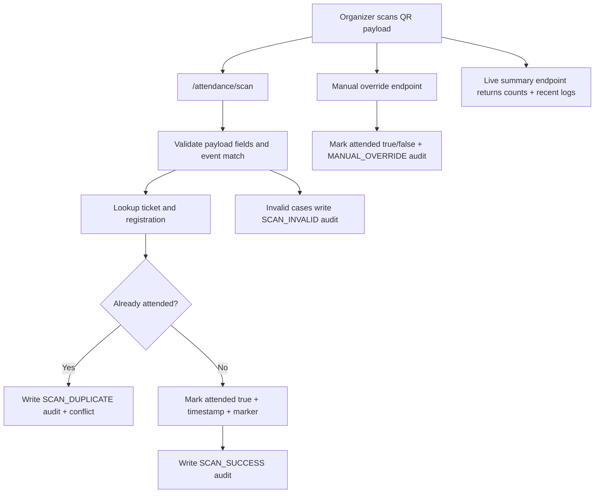

# Felicity Event Management System: End-to-End Technical Architecture

## 1) Scope and Intent
This document is a full architecture map of the repository at:
- `/home/aryamavmurthy/work/Dass_Assn/event-management-project`

It covers:
- Full-stack runtime architecture (frontend, backend, DB, GridFS, email)
- Module boundaries and control flow
- Task/feature mapping against assignment requirements
- API surface and controller ownership
- Data model design and relationships
- Critical business workflows and failure handling
- Key methods/functions by subsystem
- File-by-file purpose catalog for all project files present in source scope

## 2) Repository Topology

### 2.1 High-level layout
- `backend/`: Node 22 + Express API, MongoDB models, controllers, routes, middleware, seed script
- `frontend/`: React + Vite SPA, role-based pages, shared UI components, API client
- `scripts/`: submission/deployment validation helper
- Root docs/artifacts: assignment spec, deployment links, project README

### 2.2 Runtime boundaries
- Browser app calls backend REST APIs with cookie-based JWT session
- Backend validates/authenticates/authorizes requests and persists data in MongoDB
- GridFS stores uploaded files (custom form files + payment proofs)
- Nodemailer handles ticket/notification mail (or explicit disabled mode)
- QR ticket payload links ticket, registration, participant, event

## 3) Task/Requirement Mapping (Assignment to Implementation)

### 3.1 Core roles and access control
- Participant flows: implemented in `frontend/src/pages/*` participant pages + backend participant controllers
- Organizer flows: implemented in organizer pages + organizer controllers
- Admin flows: implemented in admin pages + admin controllers
- Enforced role-based access:
  - Frontend: `ProtectedRoute`, `PublicOnlyRoute`
  - Backend: `protect`, `restrictTo` middleware

### 3.2 Authentication and security
- Signup/login/logout with hashed passwords + JWT
- Persistent session via httpOnly cookie
- Organizer status gate (ACTIVE-only login)
- Role-based route protection across all protected endpoints

### 3.3 Participant feature set
- Browse events (search, fuzzy matching, filters, followed clubs scope, trending, recommendations)
- Event details with block reasons and eligibility enforcement
- Normal registration with dynamic custom-form response validation and file upload support
- Merchandise purchase with pending payment proof workflow
- Ticket retrieval and QR display
- Profile, interests, followed clubs, password change
- Clubs/organizers directory and detail view
- My events dashboard with upcoming + history tabs

### 3.4 Organizer feature set
- Event CRUD lifecycle: draft -> publish -> ongoing/closed -> completed
- Restricted editing rules by state
- Participant list, search/filter, attendance update, CSV export
- QR attendance scanner + duplicate/invalid protection
- Manual attendance override with reason + audit logging
- Merchandise order approval/rejection with stock + ticket/email finalization
- Organizer profile + Discord webhook for publish notifications

### 3.5 Admin feature set
- Organizer/category management + generated organizer credentials
- Organizer account status updates (ACTIVE/DISABLED/ARCHIVED)
- Permanent organizer deletion
- Password reset request orchestration + approve/reject
- Generated temp credentials on reset approval
- Admin view into organizer events and participants/files

### 3.6 Advanced features implemented (README claims, code-backed)
- Organizer password reset workflow: implemented
- Calendar export + provider links + batch ICS: implemented
- Merchandise payment approval lifecycle: implemented
- QR attendance scan + manual override + live summary/audit logs: implemented

## 4) End-to-End Architecture Diagrams

### 4.1 Auth/session flow

### 4.2 Participant normal registration flow

### 4.3 Merchandise payment approval lifecycle

### 4.4 Attendance scanner flow

### 4.5 Organizer password reset flow

### 4.6 Calendar export flow

## 5) Backend Architecture (Deep Dive)

### 5.1 Boot sequence
1. Load and validate env with zod (`config/env.js`)
2. Connect MongoDB (`config/db.js`)
3. Initialize mailer (SMTP verify or disabled mode)
4. Register middleware (`express.json`, `cookieParser`, `cors`)
5. Mount route modules
6. Register centralized error handler
7. Seed admin if missing
8. Start HTTP server

### 5.2 Cross-cutting policies
- Fail-fast env validation in startup
- Explicit typed errors with status codes and optional `code`
- No silent auth bypass; token required on protected routes
- Upload size constrained by env (`MAX_UPLOAD_MB`)
- Transaction-like rollback in critical multi-step flows (registration/ticket/email, merch approval)
- Audit logs for attendance actions

### 5.3 Data model map
- `User` base + discriminators:
  - `IIIT_PARTICIPANT`
  - `NON_IIIT_PARTICIPANT`
  - `organizer`
  - `admin`
- `OrganizationCategory`, `Interest`
- `Event` with type-specific internals:
  - `NORMAL` -> `customFormSchema`
  - `MERCHANDISE` -> `items[] -> variants[]`
- `Registration`:
  - participant-event uniqueness
  - status, responses, attendance fields
  - `merchPurchase` nested lifecycle fields
- `Ticket`: one-to-one registration ticket + QR payload
- `PasswordResetRequest`
- `AttendanceAuditLog`

### 5.4 API route ownership
- `/api/auth/*` -> auth controller
- `/api/user/*` -> profile/preferences/events/security/reset-request
- `/api/interests/*` -> interest management
- `/api/clubs/*` -> categories/clubs/public club events/club creation
- `/api/events/*` -> participant and organizer event operations
- `/api/calendar/*` -> ICS and provider links
- `/api/tickets/*` -> ticket detail retrieval
- `/api/system/*` -> email subsystem health
- `/api/admin/*` -> admin organizer/category/reset workflows

### 5.5 Critical backend methods/functions
- Auth/session:
  - `signToken`, `setAuthCookie` (`authController.js`)
  - `protect`, `restrictTo` (`authMiddleware.js`)
- Event access rules:
  - `getEventForParticipantOr404`, `getEventForOrganizerOrAdminOr404`
  - `assertEventOpen`, `assertParticipantEligibility`, `assertCapacityAvailable`
- Dynamic form and files:
  - `validateNormalResponses`
  - `buildFileResponsesFromUpload`, `rollbackGridFsFiles`
  - `uploadBufferToGridFS`, `openGridFSDownloadStream`
- Ticketing:
  - `createTicketForRegistration`
  - `sendTicketEmailStrict`
- Search/recommendation:
  - `parseListEventsQuery`, `fuzzyTokenSearchWithFuse`
  - `getTrendingEvents`
- Merch approvals:
  - `reviewMerchOrderForOrganizerEvent`
- Attendance:
  - `scanAttendanceByQr`, `manualAttendanceOverride`, `getLiveAttendanceSummary`
- Calendar:
  - `createCalendarIcs`, `getMyEventsCalendarIcs`

## 6) Frontend Architecture (Deep Dive)

### 6.1 App composition
- Entry: `main.jsx` -> `App.jsx`
- Routing: `react-router-dom` with role-protected route branches
- Auth state: `AuthProvider` centralizes session restore/login/register/logout
- API transport: axios client with `baseURL=VITE_API_URL` + `withCredentials=true`

### 6.2 Route control
- `ProtectedRoute`: blocks unauthenticated users and role mismatch
- `PublicOnlyRoute`: redirects authenticated users to role dashboard

### 6.3 UI design system
- Reusable primitives in `src/components/ui/*` (button, input, select, form, card, etc.)
- Tailwind v4 tokens + dark theme variables in `src/index.css`

### 6.4 Frontend feature modules
- Participant pages:
  - Login/Register
  - Dashboard (history, file access, calendar export)
  - BrowseEvents (search/filter/recommendations/trending + register/purchase/payment proof)
  - Clubs/Organizer discovery and details
  - Ticket details
  - Profile (edit + password + interests + followed clubs)
- Organizer pages:
  - Dashboard/Ongoing/Profile
  - Create event
  - Event detail orchestration (analytics, participants, scanner, merch approvals, lifecycle)
- Admin pages:
  - Dashboard
  - Manage clubs/organizers
  - Password reset requests
  - Organizer events
  - Event participants + uploaded file access

## 7) Logic and Flow Details by Role

### 7.1 Participant logic highlights
- Browse uses backend-prepared blocked reasons and personalization
- NORMAL registration supports mixed text/dropdown/checkbox/file responses
- MERCHANDISE purchase decouples payment proof from order creation
- Ticket page reads QR payload output directly from backend ticket record
- Dashboard supports both single ICS and multi-registration batch ICS

### 7.2 Organizer logic highlights
- Event edit constraints driven by event status and immutable fields
- Participant table supports search/status/attendance filters + CSV export
- Scanner panel supports:
  - manual payload scan
  - image decode via BarcodeDetector
  - camera polling decode loop
- Live attendance panel auto-refreshes every 5 seconds
- Merchandise approvals enforce stock integrity and rollback on downstream failure

### 7.3 Admin logic highlights
- Organizer lifecycle includes non-destructive status changes and destructive delete
- Organizer reset approvals emit credentials once and rotate password hash
- Admin participant view reuses organizer participant/file APIs through admin authorization

## 8) Environment and Operations

### 8.1 Backend env requirements
- Required always: `PORT`, `MONGO_URI`, `JWT_SECRET`, `JWT_EXPIRES_IN`, `ADMIN_EMAIL`, `ADMIN_PASSWORD`, `FRONTEND_URL`, `MAX_UPLOAD_MB`, `EMAIL_FORCE_FAIL_SEND`, `EMAIL_MODE`
- Required in smtp mode: `SMTP_HOST`, `SMTP_PORT`, `SMTP_SECURE`, `SMTP_USER`, `SMTP_PASS`, `SMTP_FROM`

### 8.2 Deployment references
- `deployment.txt` contains deployed frontend and backend URLs
- `scripts/validate-submission.sh` validates deployment file format

### 8.3 Seed/reset utility
- `backend/scripts/resetAndSeed.js` wipes collections and seeds deterministic sample data for:
  - categories, interests, organizers, participants
  - mixed event types and statuses
  - registrations/tickets/audit records

## 9) File-by-File Purpose Catalog

Note: This catalog lists source/project files that define application behavior and local project artifacts. Third-party/generated dependency trees (`node_modules`) are intentionally not expanded file-by-file because they are vendor code.

## 9.1 Root files
| File | Purpose |
|---|---|
| `.gitignore` | Ignore rules for env files, logs, builds, dependencies, caches. |
| `.nvmrc` | Pins Node major version (`22`). |
| `Assignment.md` | Full assignment specification and grading requirements. |
| `Assignment1 (3).pdf` | PDF version of assignment document. |
| `README.md` | Project summary, implemented advanced features, local run steps, key endpoints. |
| `deployment.txt` | Submitted deployment URLs (frontend and backend). |
| `tech architecture.md` | This comprehensive repository architecture reference document. |
| `scripts/validate-submission.sh` | Script to validate `deployment.txt` formatting and value quality. |

## 9.2 Backend root/config
| File | Purpose |
|---|---|
| `backend/package.json` | Backend dependencies, scripts (`start`, `seed:reset`), Node engine range. |
| `backend/package-lock.json` | Locked backend dependency tree. |
| `backend/.env.example` | Sample env template for backend configuration. |
| `backend/server.js` | API bootstrap: env load, DB connect, mailer init, middleware, routes, error handler, admin seed, listener. |
| `backend/config/db.js` | MongoDB connection helper. |
| `backend/config/env.js` | Zod-based environment schema validation and fail-fast startup config assembly. |
| `backend/config/seedAdmin.js` | Ensure initial admin account exists using env credentials. |

## 9.3 Backend middleware
| File | Purpose |
|---|---|
| `backend/middleware/authMiddleware.js` | JWT cookie/header authentication and role authorization middleware. |
| `backend/middleware/uploadMiddleware.js` | Multer memory uploads for registration/payment files and upload error mapping. |

## 9.4 Backend models
| File | Purpose |
|---|---|
| `backend/models/constants.js` | Canonical enums for event, registration, organizer status, payment status, etc. |
| `backend/models/User.js` | User discriminators (`participant/organizer/admin`), interest/category models, zod schemas for auth payloads. |
| `backend/models/Event.js` | Event schema with custom forms or merch items, validators, indexes, create/update zod schemas. |
| `backend/models/Registration.js` | Registration schema (responses, attendance, merch purchase lifecycle), indexes, zod schemas. |
| `backend/models/Ticket.js` | Ticket schema linking registration/participant/event with QR payload. |
| `backend/models/PasswordResetRequest.js` | Organizer reset request schema and zod validators for create/review. |
| `backend/models/AttendanceAuditLog.js` | Attendance scan/override audit history schema and indexes. |
| `backend/models/index.js` | Barrel exports for model/constants modules. |

## 9.5 Backend utilities
| File | Purpose |
|---|---|
| `backend/utils/Errors.js` | Error factory and reusable HTTP error constructors with optional codes. |
| `backend/utils/authUtils.js` | Currently empty placeholder utility module. |
| `backend/utils/calendarIcs.js` | ICS calendar file generation helpers (UTC conversion, escaping, folding, reminders). |
| `backend/utils/gridfs.js` | GridFS helpers for upload/delete/file info/download stream. |
| `backend/utils/mailer.js` | SMTP transport init, verify, send, status, disabled mode behavior. |
| `backend/utils/ticketEmail.js` | Ticket email body generation (text/html) and dispatch wrapper. |
| `backend/utils/discordWebhook.js` | Discord webhook notifier for published events with URL validation and delivery checks. |

## 9.6 Backend routes
| File | Purpose |
|---|---|
| `backend/routes/authRoutes.js` | Register/login/logout routes. |
| `backend/routes/userRoutes.js` | User profile/preferences/password/my-events and organizer reset request routes. |
| `backend/routes/interestRoutes.js` | Public interest list + admin CRUD routes. |
| `backend/routes/clubRoutes.js` | Categories, clubs list, public club events, admin club/category creation routes. |
| `backend/routes/eventRoutes.js` | Main event API surface (participant + organizer/admin event operations). |
| `backend/routes/calendarRoutes.js` | Calendar ICS/link endpoints for participant registrations. |
| `backend/routes/ticketRoutes.js` | Ticket lookup endpoint. |
| `backend/routes/systemRoutes.js` | System health route(s), currently email health. |
| `backend/routes/adminRoutes.js` | Admin-only category/organizer/password-reset management routes. |

## 9.7 Backend top-level controller entry points
| File | Purpose |
|---|---|
| `backend/controllers/authController.js` | Participant register/login/logout handlers and cookie token handling. |
| `backend/controllers/clubController.js` | Clubs/categories public and admin creation logic; generated organizer credentials. |
| `backend/controllers/interestController.js` | Interest listing and admin CRUD/soft-delete behavior. |
| `backend/controllers/calendarController.js` | Single and batch calendar ICS generation + provider link generation. |
| `backend/controllers/ticketController.js` | Ticket detail retrieval with role-aware access checks. |
| `backend/controllers/systemController.js` | Email mode/verification health endpoint output. |
| `backend/controllers/eventController.js` | Barrel re-export of participant and organizer event controllers. |
| `backend/controllers/userController.js` | Barrel re-export of user domain controllers. |
| `backend/controllers/adminController.js` | Barrel re-export of admin domain controllers. |

## 9.8 Backend admin controller modules
| File | Purpose |
|---|---|
| `backend/controllers/admin/index.js` | Barrel exports for admin modules. |
| `backend/controllers/admin/categoriesController.js` | Admin category list endpoint. |
| `backend/controllers/admin/organizersController.js` | Organizer list/filter, status update, permanent delete. |
| `backend/controllers/admin/passwordResetController.js` | Admin create/list/review organizer password reset requests. |

## 9.9 Backend user controller modules
| File | Purpose |
|---|---|
| `backend/controllers/user/index.js` | Barrel exports for user modules. |
| `backend/controllers/user/profileController.js` | User self profile fetch/update for participants/organizers. |
| `backend/controllers/user/preferencesController.js` | Participant interests and followed clubs update logic. |
| `backend/controllers/user/securityController.js` | Password change endpoint with current-password verification. |
| `backend/controllers/user/eventsController.js` | Participant dashboard “my events” aggregation and ticket linking. |
| `backend/controllers/user/passwordResetRequestController.js` | Organizer self-service reset request creation/listing. |
| `backend/controllers/user/utils.js` | Utility for unique normalized ID array creation. |

## 9.10 Backend shared event helpers
| File | Purpose |
|---|---|
| `backend/controllers/events/shared/index.js` | Barrel exports for event shared helper modules. |
| `backend/controllers/events/shared/errors.js` | Controller zod error mapping helper. |
| `backend/controllers/events/shared/access.js` | Event/registration access and ownership guards across roles. |
| `backend/controllers/events/shared/eligibility.js` | Registration blocking logic and participant eligibility checks. |
| `backend/controllers/events/shared/queryAndSearch.js` | Query schema parsing and fuzzy event search with Fuse.js. |
| `backend/controllers/events/shared/payloadNormalization.js` | Event payload canonicalization for form/item/variant IDs and safe update fields. |
| `backend/controllers/events/shared/registrationValidation.js` | Dynamic form response validation + file metadata extraction helpers. |
| `backend/controllers/events/shared/ticketing.js` | Ticket ID/QR generation and ticket record creation. |
| `backend/controllers/events/shared/participantsTable.js` | Participant row builder and CSV serialization utilities. |

## 9.11 Backend participant event modules
| File | Purpose |
|---|---|
| `backend/controllers/events/participant/index.js` | Barrel exports for participant event modules. |
| `backend/controllers/events/participant/listEventsController.js` | Event browse listing, filters, personalization, recommendations, trending injection. |
| `backend/controllers/events/participant/detailsController.js` | Event detail endpoint with blocked reasons/capacity context. |
| `backend/controllers/events/participant/registerController.js` | NORMAL event registration flow with file upload, ticket/email, rollback. |
| `backend/controllers/events/participant/purchaseController.js` | MERCH purchase initiation (`PAYMENT_PENDING` order creation). |
| `backend/controllers/events/participant/paymentProofController.js` | Payment proof upload/read/download and access checks. |
| `backend/controllers/events/participant/fileAccessController.js` | Registration file listing/download for participants/organizers/admin. |
| `backend/controllers/events/participant/services/trendingService.js` | 24h registration aggregate pipeline and top-5 trending event output. |
| `backend/controllers/events/participant/services/ticketEmailService.js` | Strict participant ticket email dispatch (fails on missing email/send errors). |
| `backend/controllers/events/participant/services/uploadedResponsesService.js` | Response parsing, field upload mapping, file validation, GridFS rollback. |

## 9.12 Backend organizer event modules
| File | Purpose |
|---|---|
| `backend/controllers/events/organizer/index.js` | Barrel exports for organizer modules. |
| `backend/controllers/events/organizer/lifecycleController.js` | Create/update/delete/publish/start/close/complete event lifecycle rules. |
| `backend/controllers/events/organizer/listAndDetailsController.js` | Organizer/admin event listing and single event detail retrieval. |
| `backend/controllers/events/organizer/analyticsController.js` | Event analytics aggregation (registrations/sales/revenue/attendance/status/team completion). |
| `backend/controllers/events/organizer/participantsController.js` | Participants table retrieval, attendance patch, CSV export. |
| `backend/controllers/events/organizer/attendanceScannerController.js` | QR scan validation, audit logs, manual override, live attendance summary. |
| `backend/controllers/events/organizer/merchApprovalController.js` | Merchandise orders list/filter/review with stock/ticket/email transactional rollback semantics. |

## 9.13 Backend scripts/tests artifacts
| File | Purpose |
|---|---|
| `backend/scripts/resetAndSeed.js` | Full DB reset + deterministic seed data for local testing/demo workflows. |
| `backend/tests/.event_fail_forced_send.log` | Local log artifact showing forced email-send failure behavior during testing. |

## 9.14 Frontend root/config
| File | Purpose |
|---|---|
| `frontend/package.json` | Frontend dependencies/scripts/Node engine constraints. |
| `frontend/package-lock.json` | Locked frontend dependency tree. |
| `frontend/README.md` | Default Vite React template README retained in repo. |
| `frontend/eslint.config.js` | ESLint flat configuration for JS/JSX React code. |
| `frontend/vite.config.js` | Vite config: React plugin, Tailwind plugin, `@` alias to `src`. |
| `frontend/components.json` | shadcn/ui generator/config metadata. |
| `frontend/jsconfig.json` | Path alias mapping for editor/JS tooling. |
| `frontend/index.html` | Vite HTML entry shell with root mount node. |
| `frontend/public/vite.svg` | Public icon asset placeholder (empty file currently). |
| `frontend/src/assets/react.svg` | Source asset placeholder (empty file currently). |

## 9.15 Frontend app/core/context/lib
| File | Purpose |
|---|---|
| `frontend/src/main.jsx` | React root mount and global stylesheet import; forces dark class on root element. |
| `frontend/src/App.jsx` | Complete route tree registration for participant/organizer/admin pages. |
| `frontend/src/index.css` | Tailwind v4 theme variables, base styles, dark theme tokens. |
| `frontend/src/context/auth-context-core.js` | Shared auth React context object. |
| `frontend/src/context/AuthContext.jsx` | Auth provider: restore session, login/register/logout methods. |
| `frontend/src/context/useAuth.js` | Hook wrapper to consume AuthContext safely. |
| `frontend/src/lib/api.js` | Axios instance with env-configured base URL and credentials. |
| `frontend/src/lib/utils.js` | Utility `cn` for class composition (`clsx` + `twMerge`). |

## 9.16 Frontend shared components
| File | Purpose |
|---|---|
| `frontend/src/components/ProtectedRoute.jsx` | Auth+role gate for protected routes. |
| `frontend/src/components/PublicOnlyRoute.jsx` | Redirect-authenticated users away from login/register routes. |
| `frontend/src/components/ParticipantNavbar.jsx` | Participant navigation and logout controls. |
| `frontend/src/components/OrganizerNavbar.jsx` | Organizer navigation and logout controls. |
| `frontend/src/components/AdminNavbar.jsx` | Admin navigation and logout controls. |

## 9.17 Frontend UI primitives
| File | Purpose |
|---|---|
| `frontend/src/components/ui/button-variants.js` | CVA variant definitions for button component. |
| `frontend/src/components/ui/button.jsx` | Reusable Button component with `asChild` support. |
| `frontend/src/components/ui/input.jsx` | Styled input primitive. |
| `frontend/src/components/ui/label.jsx` | Styled label primitive. |
| `frontend/src/components/ui/select.jsx` | Radix Select wrappers. |
| `frontend/src/components/ui/radio-group.jsx` | Radix RadioGroup wrappers. |
| `frontend/src/components/ui/separator.jsx` | Radix Separator wrapper. |
| `frontend/src/components/ui/card.jsx` | Card layout primitives. |
| `frontend/src/components/ui/form.jsx` | react-hook-form binding primitives (`FormField`, `FormMessage`, etc.). |
| `frontend/src/components/ui/textarea.jsx` | Styled textarea primitive. |
| `frontend/src/components/ui/checkbox.jsx` | Radix Checkbox wrapper. |

## 9.18 Frontend participant pages
| File | Purpose |
|---|---|
| `frontend/src/pages/Login.jsx` | Login form and role-based post-login redirect. |
| `frontend/src/pages/Register.jsx` | Participant registration form with onboarding interests/followed clubs selection. |
| `frontend/src/pages/Dashboard.jsx` | My events dashboard (upcoming/history), uploaded file access, calendar exports. |
| `frontend/src/pages/BrowseEvents.jsx` | Search/filter/recommend/trending explorer + normal registration + merch purchase/proof upload. |
| `frontend/src/pages/Profile.jsx` | Participant profile edit, password change, interests/clubs preferences management. |
| `frontend/src/pages/ClubsOrganizers.jsx` | Public clubs listing with follow/unfollow actions. |
| `frontend/src/pages/OrganizerDetail.jsx` | Participant-facing organizer details and upcoming/past events. |
| `frontend/src/pages/TicketDetails.jsx` | Ticket details and QR display by ticket ID. |

## 9.19 Frontend admin pages
| File | Purpose |
|---|---|
| `frontend/src/pages/AdminDashboard.jsx` | Admin landing page linking management sections. |
| `frontend/src/pages/AdminManageClubs.jsx` | Category/org creation, organizer account status actions, delete, credential display. |
| `frontend/src/pages/AdminPasswordResetRequests.jsx` | Review organizer reset requests and display generated credentials. |
| `frontend/src/pages/AdminOrganizerEvents.jsx` | Admin view of all events for a selected organizer. |
| `frontend/src/pages/AdminEventParticipants.jsx` | Admin participant/file-access panel for a specific organizer event. |

## 9.20 Frontend organizer pages
| File | Purpose |
|---|---|
| `frontend/src/pages/OrganizerDashboard.jsx` | Organizer summary + completed-event aggregate metrics + event cards. |
| `frontend/src/pages/OrganizerCreateEvent.jsx` | Draft event creation with dynamic custom-form builder or merch item/variant builder. |
| `frontend/src/pages/OrganizerOngoingEvents.jsx` | Quick list of ONGOING events. |
| `frontend/src/pages/OrganizerProfile.jsx` | Organizer profile edit + Discord webhook + reset request management. |
| `frontend/src/pages/OrganizerEventDetails.jsx` | Organizer control center: lifecycle, edits, analytics, participants/files, scanner/live/audit, merch approvals. |

## 10) Non-source/External directories present locally
These are part of the local repository working directory but are not app-authored source files:
- `backend/node_modules/` (third-party packages)
- `frontend/node_modules/` (third-party packages)
- `frontend/dist/` (frontend build output)
- `frontend/output/` (local output artifacts)
- `.git/` (git metadata)

## 11) Architectural Strengths and Coupling Notes

### Strengths
- Clear role separation across controllers/routes/pages
- Reusable event shared helpers avoid policy duplication
- Strong runtime env validation with explicit startup failure modes
- Complex workflows have rollback behavior for consistency
- Advanced feature set implemented end-to-end across UI + API + models

### Coupling/complexity hotspots
- `OrganizerEventDetails.jsx` centralizes many concerns (lifecycle + scanner + merch + participants)
- `BrowseEvents.jsx` combines listing + details + registration + purchase + payment proof state
- Some business flows rely on sequential writes without DB transactions (manual rollback logic used)

## 12) End-to-End Summary
This codebase is a role-driven MERN architecture with a single backend API serving three operational personas:
- participant experience (discovery, registration, tickets)
- organizer operations (event lifecycle, attendance, merch approvals)
- admin controls (organizer lifecycle and reset governance)

The repository implements assignment core requirements plus selected advanced features with cohesive backend business rules, a protected frontend route architecture, and supporting integrations (ICS, QR, GridFS, email, webhook).
